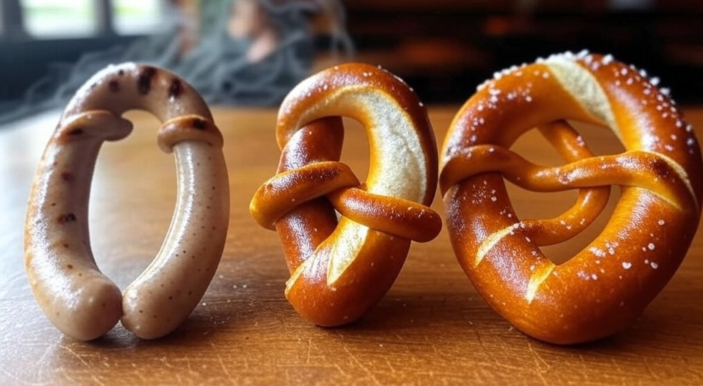

# GermanTransformer
A transformer model to predict the articles of German nouns.

  

## Primary objective
We build a BERT-like transformer model to predict the correct articles of German nouns.
We try different sizes to determine the best size/accuracy tradeoff.

## Secondary objectives
- Determine the correct article for the word 'Nutella', answering a millennium problem in the field of German linguistics.
- Find words for which the predicted article differs with high confidence from the commonly associated one in order to find words whose articles should be reconsidered.

## Results
### Overview
Our best model[^1] achieves an accuracy of 84%.
We tested a lot of different model parameters, but always converged against approximately the same accuracy, just with broadly different runtimes.
The smallest model we tested[^2] has only 406,659 parameters and still achieves an accuracy of 72%.
Most models have been trained using 82,825 examples and have been validated on 9,203. Small-scale experiments with the sizes of val and train datasets switched show that we can get the same performance with a lot fewer examples.

### Details
All raw results and model checkpoints can be found in the public [Weights and Biases project](https://wandb.ai/dominik-farr/german-articles/overview).

### Further work
A paper will be published as soon as there is a Devin-like system that simulates a grad-student that can do all the LaTeX/documentation/writing work that I don't really feel like doing.

[^1]: Named 'small-a', 12,654,595 parameters, d_model=512, num_layers=4, num_heads=4
[^2]: Named 'special-a', 406,659 parameters, d_model=32, num_layers=32, num_heads=4